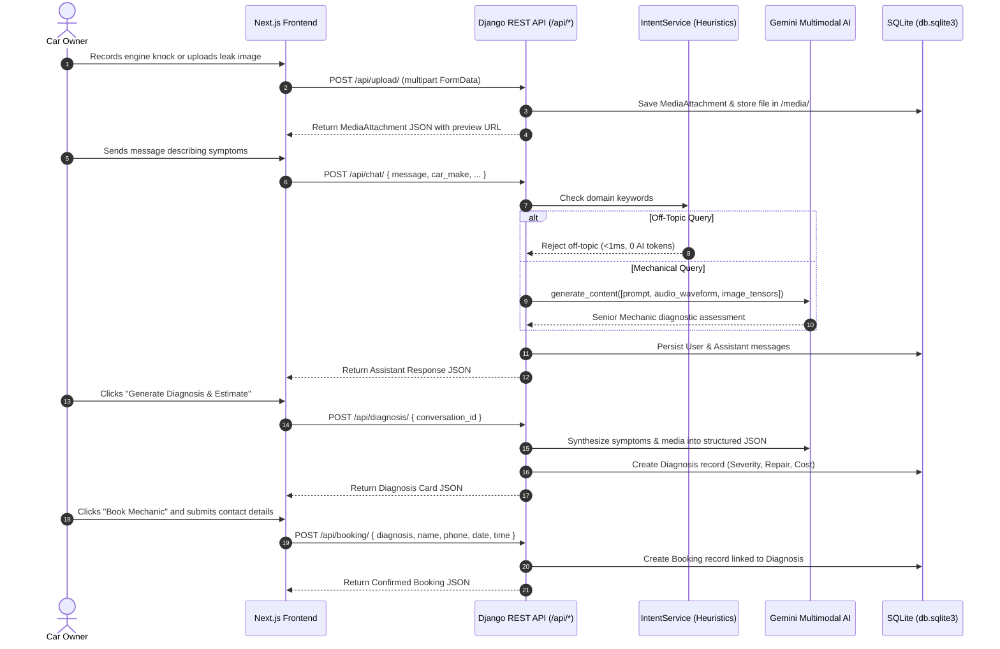
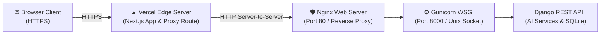

# 🚗 AI Car Mechanic Chatbot — Django REST Backend

A production-grade **Django REST Framework** backend service powering an AI-assisted Automotive Diagnostic Assistant and Mechanic Booking system. This service integrates with **Google Gemini Multimodal AI** for real-time troubleshooting, audio acoustic analysis (engine knocking, brake squeal), image inspection (dashboard warning lights, component wear), video analysis, severity assessment, and frictionless appointment booking.

---

## 🔗 Live Links
- **Backend API Base**: `http://13.234.4.236/api/`
- **Interactive API Docs (Swagger UI)**: `http://13.234.4.236/api/docs/`
- **OpenAPI Schema (JSON)**: `http://13.234.4.236/api/schema/`
- **ReDoc Documentation**: `http://13.234.4.236/api/redoc/`
- **Health Check Endpoint**: `http://13.234.4.236/api/health/`

---

## 🛠 Tech Stack & Architecture

* **Framework:** Python 3.9+ / Django 4.2+ / Django REST Framework
* **AI Engine:** Google Generative AI Multimodal SDK (`google-generativeai`)
  * **Primary High-Quota Models:** `gemini-flash-lite-latest`, `gemini-3.5-flash-lite`, `gemini-3.1-flash-lite` (15 RPM / 500 Requests Per Day)
  * **Failover Models:** `gemini-flash-latest`, `gemini-pro-latest`
  * **Fallback Layer:** Offline Deterministic Senior Technician Rule Matrix
* **Media Processing:** Pillow (`PIL.Image`) for vision tensors + `genai.upload_file` for native audio waveforms and video streams
* **API Documentation:** `drf-spectacular` (OpenAPI 3.0 & Swagger UI at `/api/docs/`)
* **Database:** SQLite (default development database, PostgreSQL compatible)
* **Testing:** Django Test Suite & `pytest-django` (`15/15 tests passing`)

---

## 🚀 Key Features

* 💬 **Automotive Diagnostic Chat (`POST /api/chat/`):** Context-aware mechanic conversation tailored to the vehicle's make, model, year, and reported symptoms.
* 🎙️ **Live Audio Acoustic Analysis (`POST /api/upload/`):** Ingests recorded engine sounds, rattles, squeals, or knocks, uploading waveforms directly to Gemini's audio encoder to pinpoint friction wear, misfires, or loose components.
* 📷 **Visual & Video Inspection:** Evaluates images and video recordings (exhaust smoke color, serpentine belt wobble, fluid leaks) through multimodal vision context.
* ⚡ **Zero-Token Intent Pre-Filtering (`IntentService`):** Deterministically evaluates queries before calling the LLM. Rejects non-automotive queries (recipes, coding, politics) in `<1ms` with **0 API tokens spent**.
* 📋 **Diagnostic Summary & Cost Report (`POST /api/diagnosis/`):** Categorizes issues with standardized severity ratings (*Low*, *Medium*, *High*, *Critical*), recommended repairs, and itemized cost ranges.
* 📅 **Mechanic Appointment Booking (`POST /api/booking/`):** Seamless session-based guest booking tied to diagnostic records with status tracking.
* 🛡️ **Graceful Fallback & Model Failover:** Automatically rotates across high-capacity Gemini models (500 RPD) upon any 429 rate limit or network error, ensuring the user experience never crashes.

---

## 📋 Requirements & Prerequisites

* **Python 3.9+** (Tested on Python 3.9, 3.10, 3.11, 3.12)
* **Google Gemini API Key** (Free from [Google AI Studio](https://aistudio.google.com/))

---

## ⚙️ Installation & Local Setup

### 1. Clone the Repository
```bash
git clone https://github.com/ChetanSingh14/AI-Car-Mechanic-Chatbot-Backend.git
cd AI-Car-Mechanic-Chatbot-Backend
```

### 2. Create and Activate Virtual Environment
```bash
python3 -m venv venv
source venv/bin/activate
```

> **Note for macOS / Linux:** If `python` is not aliased in your shell, always use `python3` and `pip` within the activated `venv`.

### 3. Install Dependencies
```bash
pip install -r requirements.txt
```

### 4. Environment Configuration
Copy `.env.example` to create your `.env` file:
```bash
cp .env.example .env
```

Open `.env` and set your configuration:
```env
DEBUG=True
SECRET_KEY=your_django_secret_key_here
ALLOWED_HOSTS=localhost,127.0.0.1
CORS_ALLOWED_ORIGINS=http://localhost:3000,http://127.0.0.1:3000
GEMINI_API_KEY=your_gemini_api_key_here
```

### 5. Apply Database Migrations
```bash
python3 manage.py migrate
```

### 6. Start the Development Server
```bash
python3 manage.py runserver
```
The backend will be available at `http://127.0.0.1:8000/`.

---

## 🧪 Running Tests

Run the automated test suite verifying all 5 core endpoints and intent classification:
```bash
python3 manage.py test api.tests.test_api
```

Or using `pytest`:
```bash
pytest
```

---

## 📡 API Endpoints Specification

| Method | Endpoint | Description |
| :--- | :--- | :--- |
| `POST` | `/api/chat/` | Send message & receive AI diagnostic response |
| `POST` | `/api/upload/` | Upload image, audio recording, or video attachment |
| `POST` | `/api/diagnosis/` | Generate diagnostic summary & severity report |
| `POST` | `/api/booking/` | Create mechanic appointment booking |
| `GET` | `/api/booking/<uuid>/` | Fetch booking confirmation details |
| `GET` | `/api/conversation/<uuid>/` | Retrieve full chat and diagnostic history |
| `GET` | `/api/docs/` | Interactive Swagger UI documentation |
| `GET` | `/api/redoc/` | ReDoc API documentation |

---

## 🔄 Multimodal Data Flow



---

## 📁 Project Structure

```
backend/
├── api/
│   ├── models.py            # Normalized ORM Schemas (Conversation, Message, MediaAttachment, Diagnosis, Booking)
│   ├── views.py             # Thin REST Controllers (Chat, Upload, Diagnosis, Booking)
│   ├── serializers.py       # Two-way payload validation and JSON formatters
│   ├── services/            # Isolated Business Logic Layer
│   │   ├── intent_service.py   # Rule-based heuristics & off-topic filter (AI token saver)
│   │   ├── gemini_service.py   # Multimodal Gemini engine (Audio/Video/Vision) with failover
│   │   └── booking_service.py  # Appointment reservation and verification
│   ├── tests/               # Automated unit & integration tests
│   └── urls.py              # Application URL routing
├── core/
│   ├── settings.py          # Master configuration (CORS, DB, Media, DRF)
│   ├── urls.py              # Root URL dispatcher & Swagger endpoints
│   ├── exceptions.py        # Centralized Exception Normalizer
│   └── wsgi.py
├── media/uploads/           # User-uploaded images, audio recordings, and videos
├── manage.py
├── requirements.txt
├── .env.example
├── .gitignore
└── README.md
```

---

---

## 🚢 Production Deployment Guide

This full-stack application is deployed using **AWS EC2 (Ubuntu 24.04/22.04 LTS)** for the Django REST backend and **Vercel** for the Next.js frontend.



---

### Phase 1: AWS EC2 Backend Deployment (Django + Gunicorn + Nginx)

#### 1. Launch EC2 Instance & Security Groups
* **AMI:** Ubuntu 24.04 LTS or 22.04 LTS
* **Instance Type:** `t3.micro` or `t2.micro`
* **Inbound Security Group Rules:**
  * `SSH` (Port 22) -> Your IP or Anywhere
  * `HTTP` (Port 80) -> `0.0.0.0/0` (Anywhere)
  * `HTTPS` (Port 443) -> `0.0.0.0/0` (Anywhere)

#### 2. Connect & Install System Dependencies
```bash
sudo apt update && sudo apt upgrade -y
sudo apt install -y python3-pip python3-venv nginx git
```

#### 3. Clone Repository & Setup Virtual Environment
```bash
cd /home/ubuntu
git clone https://github.com/ChetanSingh14/AI-Car-Mechanic-Chatbot-Backend.git
cd AI-Car-Mechanic-Chatbot-Backend

python3 -m venv venv
source venv/bin/activate
pip install --upgrade pip
pip install -r requirements.txt gunicorn
```

#### 4. Configure Production Environment Variables
Create the production `.env` file:
```bash
nano .env
```
Populate with your configuration:
```env
DEBUG=False
SECRET_KEY=your_production_secret_key_here
ALLOWED_HOSTS=*
CSRF_TRUSTED_ORIGINS=https://*.vercel.app,http://<your-ec2-ip-or-domain>
GEMINI_API_KEY=your_gemini_api_key_here
```
Save with `Ctrl + O` -> `Enter` -> `Ctrl + X`.

#### 5. Apply Migrations & Static Files
```bash
python3 manage.py migrate
python3 manage.py collectstatic --noinput
```

#### 6. Configure Gunicorn Systemd Service
Create the Gunicorn service daemon:
```bash
sudo nano /etc/systemd/system/gunicorn.service
```
Paste the following unit configuration:
```ini
[Unit]
Description=Gunicorn daemon for AI Car Mechanic Chatbot
After=network.target

[Service]
User=ubuntu
Group=www-data
WorkingDirectory=/home/ubuntu/AI-Car-Mechanic-Chatbot-Backend
ExecStart=/home/ubuntu/AI-Car-Mechanic-Chatbot-Backend/venv/bin/gunicorn \
          --workers 3 \
          --bind 127.0.0.1:8000 \
          --access-logfile - \
          --error-logfile - \
          core.wsgi:application

[Install]
WantedBy=multi-user.target
```

Enable and start Gunicorn:
```bash
sudo systemctl daemon-reload
sudo systemctl start gunicorn
sudo systemctl enable gunicorn
sudo systemctl status gunicorn
```

#### 7. Configure Nginx as Reverse Proxy
Create the Nginx server block:
```bash
sudo nano /etc/nginx/sites-available/car_mechanic
```
Paste the following configuration (replace `13.234.4.236` with your public IP):
```nginx
server {
    listen 80;
    server_name <your-ec2-ip-or-domain>;

    client_max_body_size 50M;


    # Proxy API requests to Gunicorn
    location / {
        proxy_pass http://127.0.0.1:8000;
        proxy_set_header Host $host;
        proxy_set_header X-Real-IP $remote_addr;
        proxy_set_header X-Forwarded-For $proxy_add_x_forwarded_for;
        proxy_set_header X-Forwarded-Proto $scheme;
    }

    # Serve static files directly via Nginx
    location /static/ {
        alias /home/ubuntu/AI-Car-Mechanic-Chatbot-Backend/staticfiles/;
    }

    # Serve media uploads (audio/images/videos)
    location /media/ {
        alias /home/ubuntu/AI-Car-Mechanic-Chatbot-Backend/media/;
    }
}
```

Enable the site and restart Nginx:
```bash
sudo ln -s /etc/nginx/sites-available/car_mechanic /etc/nginx/sites-enabled/
sudo rm -f /etc/nginx/sites-enabled/default
sudo nginx -t
sudo systemctl restart nginx
```

#### 8. Set File System Permissions for Media Uploads
To allow Nginx (`www-data` user) to read and stream user uploads without `403 Forbidden` errors:
```bash
# Allow Nginx to traverse home directory
sudo chmod 755 /home/ubuntu

# Grant read/write access to media files
sudo chmod -R 775 /home/ubuntu/AI-Car-Mechanic-Chatbot-Backend/media
sudo chown -R ubuntu:www-data /home/ubuntu/AI-Car-Mechanic-Chatbot-Backend/media
sudo systemctl reload nginx
```

---

### Phase 2: Frontend Deployment on Vercel


#### 1. Import Repository into Vercel
1. Log in to [Vercel](https://vercel.com) and click **Add New Project**.
2. Select your `AI-Car-Mechanic-Chatbot-Frontend` repository.
3. Framework Preset: **Next.js** (detected automatically).

#### 2. Set Environment Variables
In the **Environment Variables** section:
* `NEXT_PUBLIC_API_URL`: `/api`
* `BACKEND_API_URL`: `http://<your-ec2-ip-or-domain>/api`


#### 3. Mixed Content & SSL Protection
Because Vercel runs on `https://` and EC2 IP addresses default to `http://`, the frontend includes built-in Next.js proxy route handlers (`/api/backend/*` and `/media/*`). This routes calls server-to-server, preventing browser Mixed Content blocking while ensuring fast streaming.

#### 4. Deploy
Click **Deploy**. Your frontend is live with SSL at `https://your-project.vercel.app`.

---

### Phase 3: Continuous Updates & Maintenance

Whenever you push new code to GitHub, update your AWS EC2 server in seconds:

```bash
cd /home/ubuntu/AI-Car-Mechanic-Chatbot-Backend
git pull origin main
source venv/bin/activate
pip install -r requirements.txt
python3 manage.py migrate
sudo systemctl restart gunicorn
```

---

## 📄 License
This project is licensed under the MIT License.

