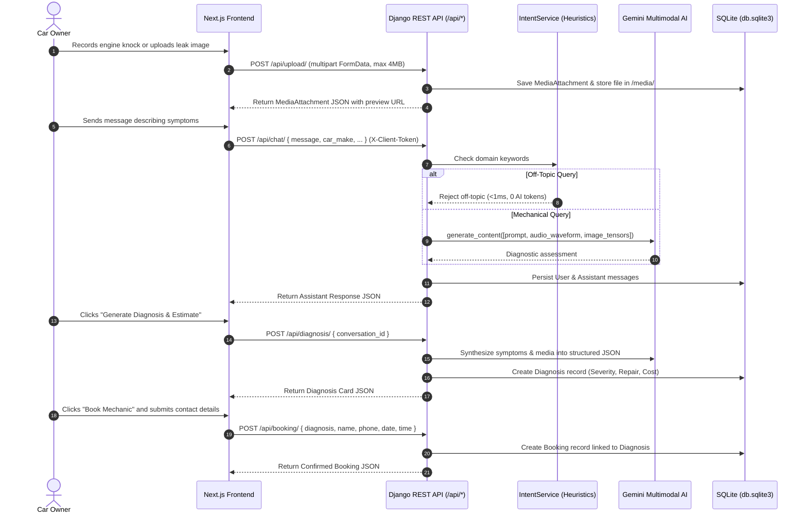
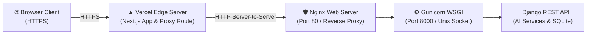

# 🚗 AI Car Mechanic Chatbot — Django REST Backend

A **Django REST Framework** backend service powering an AI-assisted Automotive Diagnostic Assistant and Mechanic Booking system. This service integrates with **Google Gemini Multimodal AI** for automotive troubleshooting, audio acoustic analysis (engine knocking, brake squeal), image inspection (dashboard warning lights, component wear), video analysis, severity assessment, and appointment booking with anonymous client session privacy isolation.

---

## 🔗 Live Links
- **[Live Frontend Application](https://ai-car-mechanic-chatbot-frontend.vercel.app)**
- **[Backend API Base](http://13.234.4.236/api/)**
- **[Interactive API Docs (Swagger UI)](http://13.234.4.236/api/docs/)**
- **[OpenAPI Schema (JSON)](http://13.234.4.236/api/schema/)**
- **[ReDoc Documentation](http://13.234.4.236/api/redoc/)**
- **[Health Check Endpoint](http://13.234.4.236/api/health/)**

---

## 🛠 Tech Stack & Architecture

* **Framework:** Python 3.10+ / Django 4.2+ / Django REST Framework
* **AI Engine:** Google Generative AI Multimodal SDK (`google-generativeai`)
  * **Supported Models (Configurable via `GEMINI_MODELS`):** `gemini-2.5-flash`, `gemini-2.5-flash-lite`, `gemini-flash-latest`
  * **Fallback Layer:** xAI Grok API (`grok-2-latest`) + Offline Deterministic Automotive Rule Matrix (`is_ai_generated: false`)
* **Media Processing:** Pillow (`PIL.Image`) for vision tensors and `genai.upload_file` for native audio waveforms and video streams (4 MB limit)
* **API Documentation:** `drf-spectacular` (OpenAPI 3.0 & Swagger UI at `/api/docs/`)
* **Database:** SQLite (default development database, PostgreSQL compatible)
* **Testing:** Django Test Suite (`28/28 tests passing`)

---

## 🤖 Rule-Based (0-Token) vs. Gemini AI Execution Matrix

To optimize response latency, eliminate unnecessary token expenditures, and guarantee robust fallback behavior, the system separates requests into deterministic rule evaluation and multimodal AI processing:

| Feature / Request Type | Execution Engine | Token Cost | Behavior & Fallback |
| :--- | :--- | :--- | :--- |
| **Off-Topic / Non-Automotive Chat** | `IntentService` (Rules) | **0 Tokens** | Evaluates keywords and regex patterns in `<1ms`. Rejects non-automotive queries (e.g. general chat, recipes, coding) without calling external AI. |
| **Known OBD-II Trouble Codes** | Rule Matrix / Knowledge Base | **0 Tokens** | Direct OBD-II code lookups (`P0300`, `P0420`, `P0171`, etc.) return structured technical definitions, root causes, and inspection procedures immediately without AI consumption. |
| **Automotive Diagnostic Chat** | Gemini Multimodal AI / Grok AI | Active Quota | Context-aware diagnostic conversation incorporating vehicle make, model, year, and reported symptoms. Returns `is_ai_generated: true`. |
| **Audio Acoustic Analysis** | Gemini Multimodal AI | Active Quota | Ingests recorded audio (knocking, squeal, rattle) to analyze frequency profile and mechanical friction wear. |
| **Image & Video Inspection** | Gemini Multimodal Vision | Active Quota | Inspects photos and video clips (exhaust smoke, belt wobble, fluid leaks, dashboard lights). |
| **Diagnostic Report Generation** | Gemini Structured AI / Grok AI | Active Quota | Synthesizes chat history, vehicle specs, and media findings into a structured diagnosis with severity, recommended service, and estimated repair cost ranges. |
| **Multi-Tier AI & Offline Fallback** | Grok AI -> Deterministic Engine | **0 Tokens (Rules)** | When `GEMINI_API_KEY` hits rate limits or errors, the server cascades to Grok (`GROK_API_KEY`). If AI services are offline, it responds with an honest structured rule-based message (`is_ai_generated: false`), leaves media analysis pending for retry, and prompts the user to describe what they see/hear. |
| **Session & Booking Operations** | DRF ORM / Database | **0 Tokens** | Session creation, listing, deleting, client-token isolation (`X-Client-Token`), booking reservations, and status retrieval run purely on the database. |

---

## 🚀 Key Features

* 💬 **Automotive Diagnostic Chat (`POST /api/chat/`):** Context-aware mechanic conversation tailored to the vehicle's make, model, year, and symptoms.
* 🎙️ **Audio Acoustic Analysis (`POST /api/upload/`):** Ingests recorded engine sounds, rattles, squeals, or knocks, uploading waveforms directly to Gemini's audio encoder to pinpoint friction wear, misfires, or loose components.
* 📷 **Visual & Video Inspection:** Evaluates images and video recordings (exhaust smoke color, serpentine belt wobble, fluid leaks) through multimodal vision context.
* ⚡ **Zero-Token Intent & OBD-II Pre-Filtering (`IntentService`):** Deterministically evaluates queries before calling the LLM. Instantly resolves known OBD-II codes (`P0300`, `P0420`, etc.) and rejects off-topic queries in `<1ms` with **0 API tokens spent**.
* 📋 **Diagnostic Summary & Cost Report (`POST /api/diagnosis/`):** Categorizes issues with standardized severity ratings (*Low*, *Medium*, *High*, *Critical*), recommended repairs, and realistic repair cost ranges. Uses caching based on `updated_at`.
* 📅 **Mechanic Appointment Booking (`POST /api/booking/`):** Session-based guest booking tied to diagnostic records with status tracking.
* 🔒 **Privacy & Client Isolation:** Client browser token (`X-Client-Token`) isolates conversations and booking records per user session with 404 access control on mismatched or missing tokens.
* 🛡️ **Multi-Tier AI Failover (Gemini -> Grok -> Rule Matrix):** Rotates across active Gemini models (`gemini-2.5-flash`, `gemini-2.5-flash-lite`, `gemini-flash-latest`), cascades to xAI Grok if quota is exhausted, and cleanly falls back to the deterministic Senior Technician Rule Matrix.

---

## 📋 Requirements & Prerequisites

* **Python 3.10+** (Tested on Python 3.10, 3.11, 3.12)
* **Google Gemini API Key** (from [Google AI Studio](https://aistudio.google.com/))

---

## ⚙️ Installation & Local Setup

### 1. Clone the Repository
```bash
git clone https://github.com/ChetanSingh14/AI-Car-Mechanic-Chatbot-Backend.git
cd AI-Car-Mechanic-Chatbot-Backend
```

### 2. Create and Activate Virtual Environment
```bash
python3 -m venv venv
source venv/bin/activate
```

### 3. Install Dependencies
```bash
pip install -r requirements.txt
```

### 4. Environment Configuration
Copy `.env.example` to create your `.env` file:
```bash
cp .env.example .env
```

Open `.env` and set your configuration:
```env
DEBUG=True
SECRET_KEY=your_django_secret_key_here
ALLOWED_HOSTS=localhost,127.0.0.1
CORS_ALLOWED_ORIGINS=http://localhost:3000,http://127.0.0.1:3000

# Primary Multimodal AI (Google Gemini)
GEMINI_API_KEY=your_gemini_api_key_here
GEMINI_MODELS=gemini-2.5-flash,gemini-2.5-flash-lite,gemini-flash-latest

# Secondary AI Fallback (xAI Grok API)
GROK_API_KEY=your_grok_key_here
GROK_MODELS=grok-2-latest,grok-2,grok-beta
```

#### 🔑 Steps to Add Grok (xAI) Fallback API Key:
1. Visit the [xAI Console](https://console.x.ai/) and create an account.
2. Go to **API Keys** and generate a new secret API key.
3. Add the key to your backend `.env` file:
   ```env
   GROK_API_KEY=xai-your-generated-api-key-here
   ```
4. *How it works:* If Google Gemini reaches free-tier rate limits (429 quota exhaustion) or experiences network timeouts, the backend automatically cascades diagnostic inquiries to Grok (`grok-2-latest`). If both AI keys are exhausted or offline, it safely defaults to the zero-token Senior Technician Rule Matrix.

### 5. Apply Database Migrations
```bash
python3 manage.py migrate
```

### 6. Start the Development Server
```bash
python3 manage.py runserver
```
The backend will be available at `http://127.0.0.1:8000/`.

---

## 🧪 Running Tests

Run the automated test suite verifying all 5 core endpoints, client privacy isolation, 4 MB upload limits, intent classification, and OpenAPI schema compliance:
```bash
python3 manage.py test api
```

Validate OpenAPI schema with `drf-spectacular`:
```bash
python3 manage.py spectacular --validate --fail-on-warn
```

---

## 📡 API Endpoints Specification

| Method | Endpoint | Description |
| :--- | :--- | :--- |
| `POST` | `/api/chat/` | Send message & receive AI diagnostic response |
| `POST` | `/api/upload/` | Upload image, audio recording, or video attachment (max 4 MB) |
| `POST` | `/api/diagnosis/` | Generate diagnostic summary & severity report |
| `POST` | `/api/booking/` | Create mechanic appointment booking |
| `GET` | `/api/booking/<uuid>/` | Fetch booking confirmation details |
| `GET` | `/api/booking/` | List bookings for current client token |
| `GET` | `/api/conversation/<uuid>/` | Retrieve full chat and diagnostic history |
| `GET` | `/api/conversation/` | List conversations for current client token |
| `DELETE`| `/api/conversation/<uuid>/` | Delete conversation for current client token |
| `GET` | `/api/health/` | Service health status |
| `GET` | `/api/docs/` | Interactive Swagger UI documentation |
| `GET` | `/api/redoc/` | ReDoc API documentation |
| `GET` | `/api/schema/` | OpenAPI 3.0 Schema (YAML/JSON) |

---

## 🔄 Multimodal Data Flow



---

## 📁 Project Structure

```
backend/
├── api/
│   ├── models.py            # Normalized ORM Schemas (Conversation, Message, MediaAttachment, Diagnosis, Booking)
│   ├── views.py             # Thin REST Controllers (Chat, Upload, Diagnosis, Booking, Conversation)
│   ├── serializers.py       # Two-way payload validation and JSON formatters
│   ├── services/            # Isolated Business Logic Layer
│   │   ├── intent_service.py   # Rule-based heuristics & off-topic filter (AI token saver)
│   │   ├── gemini_service.py   # Multimodal Gemini engine (Audio/Video/Vision) with failover
│   │   └── booking_service.py  # Appointment reservation and verification
│   ├── tests/               # Automated unit & integration tests (28 tests)
│   └── urls.py              # Application URL routing
├── core/
│   ├── settings.py          # Master configuration (CORS, DB, Media, DRF)
│   ├── urls.py              # Root URL dispatcher & Swagger endpoints
│   ├── exceptions.py        # Centralized Exception Normalizer
│   └── wsgi.py
├── media/uploads/           # User-uploaded images, audio recordings, and videos
├── manage.py
├── requirements.txt
├── .env.example
├── .gitignore
└── README.md
```

---

## 🚢 Production Deployment Guide

This full-stack application is deployed using **AWS EC2 (Ubuntu 24.04/22.04 LTS)** for the Django REST backend and **Vercel** for the Next.js frontend.



---

### Phase 1: AWS EC2 Backend Deployment (Django + Gunicorn + Nginx)

#### 1. Launch EC2 Instance & Security Groups
* **AMI:** Ubuntu 24.04 LTS or 22.04 LTS
* **Instance Type:** `t3.micro` or `t2.micro`
* **Inbound Security Group Rules:**
  * `SSH` (Port 22) -> Your IP or Anywhere
  * `HTTP` (Port 80) -> `0.0.0.0/0` (Anywhere)
  * `HTTPS` (Port 443) -> `0.0.0.0/0` (Anywhere)

#### 2. Connect & Install System Dependencies
```bash
sudo apt update && sudo apt upgrade -y
sudo apt install -y python3-pip python3-venv nginx git
```

#### 3. Clone Repository & Setup Virtual Environment
```bash
cd /home/ubuntu
git clone https://github.com/ChetanSingh14/AI-Car-Mechanic-Chatbot-Backend.git
cd AI-Car-Mechanic-Chatbot-Backend

python3 -m venv venv
source venv/bin/activate
pip install --upgrade pip
pip install -r requirements.txt gunicorn
```

#### 4. Configure Production Environment Variables
Create the production `.env` file:
```bash
nano .env
```
Populate with your configuration:
```env
DEBUG=False
SECRET_KEY=your_production_secret_key_here
ALLOWED_HOSTS=13.234.4.236,localhost,127.0.0.1
CSRF_TRUSTED_ORIGINS=https://*.vercel.app,http://<your-ec2-ip-or-domain>
GEMINI_API_KEY=your_gemini_api_key_here
GEMINI_MODELS=gemini-2.5-flash,gemini-2.5-flash-lite,gemini-flash-latest
# GROK_API_KEY=xai-your-key-here
```

#### 5. Apply Migrations & Static Files
```bash
python3 manage.py migrate
python3 manage.py collectstatic --noinput
```

#### 6. Configure Gunicorn Systemd Service
Create the Gunicorn service daemon:
```bash
sudo nano /etc/systemd/system/gunicorn.service
```
Paste the following unit configuration:
```ini
[Unit]
Description=Gunicorn daemon for AI Car Mechanic Chatbot
After=network.target

[Service]
User=ubuntu
Group=www-data
WorkingDirectory=/home/ubuntu/AI-Car-Mechanic-Chatbot-Backend
ExecStart=/home/ubuntu/AI-Car-Mechanic-Chatbot-Backend/venv/bin/gunicorn \
          --workers 3 \
          --bind 127.0.0.1:8000 \
          --access-logfile - \
          --error-logfile - \
          core.wsgi:application

[Install]
WantedBy=multi-user.target
```

Enable and start Gunicorn:
```bash
sudo systemctl daemon-reload
sudo systemctl start gunicorn
sudo systemctl enable gunicorn
sudo systemctl status gunicorn
```

#### 7. Configure Nginx as Reverse Proxy
Create the Nginx server block:
```bash
sudo nano /etc/nginx/sites-available/car_mechanic
```
Paste the following configuration (replace `<your-ec2-ip-or-domain>` with your public IP or domain):
```nginx
server {
    listen 80;
    server_name <your-ec2-ip-or-domain>;

    client_max_body_size 10M;

    # Proxy API requests to Gunicorn
    location / {
        proxy_pass http://127.0.0.1:8000;
        proxy_set_header Host $host;
        proxy_set_header X-Real-IP $remote_addr;
        proxy_set_header X-Forwarded-For $proxy_add_x_forwarded_for;
        proxy_set_header X-Forwarded-Proto $scheme;
    }

    # Serve static files directly via Nginx
    location /static/ {
        alias /home/ubuntu/AI-Car-Mechanic-Chatbot-Backend/staticfiles/;
    }

    # Serve media uploads (audio/images/videos)
    location /media/ {
        alias /home/ubuntu/AI-Car-Mechanic-Chatbot-Backend/media/;
    }
}
```

Enable the site and restart Nginx:
```bash
sudo ln -s /etc/nginx/sites-available/car_mechanic /etc/nginx/sites-enabled/
sudo rm -f /etc/nginx/sites-enabled/default
sudo nginx -t
sudo systemctl restart nginx
```

#### 8. Set File System Permissions for Media Uploads
```bash
sudo chmod 755 /home/ubuntu
sudo chmod -R 775 /home/ubuntu/AI-Car-Mechanic-Chatbot-Backend/media
sudo chown -R ubuntu:www-data /home/ubuntu/AI-Car-Mechanic-Chatbot-Backend/media
sudo systemctl reload nginx
```

---

### Phase 2: Frontend Deployment on Vercel

#### 1. Import Repository into Vercel
1. Log in to [Vercel](https://vercel.com) and click **Add New Project**.
2. Select your `AI-Car-Mechanic-Chatbot-Frontend` repository.
3. Framework Preset: **Next.js** (detected automatically).

#### 2. Set Environment Variables
In the **Environment Variables** section on Vercel:
* `BACKEND_API_URL`: `http://<your-ec2-ip-or-domain>/api`
* `NEXT_PUBLIC_API_URL`: `http://<your-ec2-ip-or-domain>/api`

*(Do not set `NEXT_PUBLIC_API_URL=/api` on Vercel, as the Next.js server proxy resolves target URLs using `BACKEND_API_URL` or `NEXT_PUBLIC_API_URL` to route calls server-to-server to your EC2 backend).*

#### 3. Mixed Content & SSL Protection
Because Vercel runs on `https://` and EC2 IP addresses default to `http://`, the frontend includes built-in Next.js proxy route handlers (`/api/backend/*` and `/media/*`). This routes calls server-to-server, preventing browser Mixed Content blocking while ensuring fast streaming.

#### 4. Deploy
Click **Deploy**. Your frontend is live with SSL at `https://your-project.vercel.app`.

---

### Phase 3: Continuous Updates & Maintenance

Whenever you push new code to GitHub, update your AWS EC2 server:

```bash
cd /home/ubuntu/AI-Car-Mechanic-Chatbot-Backend
git pull origin main
source venv/bin/activate
pip install -r requirements.txt
python3 manage.py migrate
sudo systemctl restart gunicorn
```

---

## 📄 License
This project is licensed under the MIT License.
